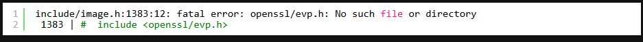
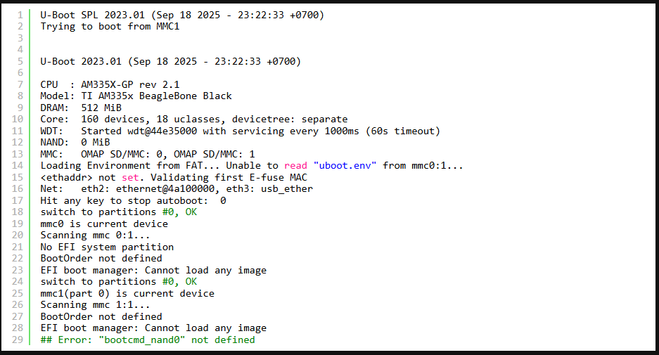
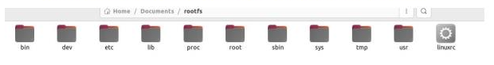

# Phần 1 — Quy trình cài đặt BeagleBone Black (BBB)

> Mục tiêu: từ máy phát triển (Ubuntu 20.04/22.04) tạo ra các thành phần cần thiết để BBB khởi động:
> - U-Boot (MLO, u-boot.img)
> - Kernel (zImage, dtb, modules)
> - Root filesystem (rootfs) có thể là ext4 hoặc image do Buildroot tạo

***

## Mục lục
1. [Tổng quan](#tổng-quan)  
2. [Chuẩn bị môi trường (Prerequisites)](#chuẩn-bị-môi-trường)  
3. [Chuẩn bị Cross Toolchain](#chuẩn-bị-cross-toolchain)  
4. [Biên dịch & cài đặt U-Boot](#biên-dịch--cài-đặt-u-boot)  
5. [Biên dịch & cài đặt Kernel](#biên-dịch--cài-đặt-kernel)  
6. [Tạo / Chuẩn bị Root Filesystem (RootFS)](#tạo--chuẩn-bị-root-filesystem-rootfs)  
7. [Ghi file lên thẻ SD và kiểm tra boot](#ghi-file-lên-thẻ-sd-và-kiểm-tra-boot)  
8. [Troubleshooting & Lưu ý hữu ích](#troubleshooting--lưu-ý-hữu-ích)  
9. [Checklist hoàn thành](#checklist-hoàn-thành)

***

## 1. Tổng quan

Quy trình chia làm 4 bước chính:

1. **Toolchain**: cài cross-compiler cho ARM (ví dụ `arm-linux-gnueabihf-`).
2. **U-Boot**: build U-Boot cho board BeagleBone Black (sinh `MLO` và `u-boot.img`).
3. **Kernel**: build kernel (zImage), device tree blob (dtb) tương ứng và modules.
4. **RootFS**: tạo root filesystem (có thể dùng Buildroot, debootstrap hoặc image có sẵn) và copy các file cần thiết lên thẻ SD.

***

## 2. Chuẩn bị môi trường

**Máy phát triển**: Ubuntu 20.04/22.04 recommended. Cài các tool cơ bản:

```bash
sudo apt update
sudo apt install -y build-essential git bc u-boot-tools wget \
  libncurses5-dev libssl-dev flex bison device-tree-compiler \
  qemu-user-static debootstrap
  ```
  Note : Các bạn có thể sử dụng máy ảo Vmware hoặc WSL để chạy Ubuntu nhé, sau đó ta sẽ sử dụng Visual Studio Code để SSH vào máy ảo phục vụ cho việc làm quen sử dụng với command line nhiều hơn.

Oke , bây giờ ta sẽ đi vào chi tiết cách cài đặt cho từng phần nhé!!!


## 3. Chuẩn bị Cross Toolchain bằng CrossToo-NG 
Ở đây, ta sẽ build toolchain từ source cho Crosstool_NG, U-boot, Buildroot, Busy Box.
``` text
3.1. Tại sao ta bắt đầu với cross compiler tool
3.2. Compile Crosstool-ng
3.3. Tạo toolchain cho Beaglebon Black bằng Crosstool-NG
3.4. Test thử toolchain mới tạo ra
3.5. Tham khảo
```
***
#### 3.1. Tại sao ta bắt đầu với cross compiler tool
Embedded Linux (Nhúng Linux) sẽ bao gồm 4 thành phần chính

Toolchain: Compiler (trình biên dịch) và 1 số tool khác để tạo ra code cho thiết bị.
Bootloader: Chương trình khởi tạo cho board, và nạp kernel
Kernel : Trái tim của hệ thống, kiểm soát tài nguyên và giao tiếp phần cứng
Root file system: Chứa các thư viện, và chương trình chạy 1 khi kernel khởi tạo xong
Trong toolchain có hai kiểu trình biên dịch:

Native compiler: Biên dịch trên và cho cùng một kiến trúc (ví dụ: build trên ARM cho ARM).
Cross-compiler: Biên dịch trên một kiến trúc (x86_64 laptop) nhưng tạo mã cho kiến trúc khác (ARM).
Trong thực tế, cross-compiler thường nhanh và tiện hơn cho nhà phát triển (máy build mạnh hơn, dễ tự động hoá).

Bài này mình sẽ dùng crosstool-ng để tạo toolchain phục vụ cross-compile.

***
#### 3.2. Compile croosstool-ng
Clone source code về:
``` bash
1. git clone https://github.com/crosstool-ng/crosstool-ng
2. cd crosstool-ng/
```
Cấu hình trực tiếp tại local thay vì export tới PATH
```bash
1. bootstrap
2. ./configure -- enable-local
```
Rồi compile thôi!
```bash
make
```
Đợi một lúc để sau khi make xong, là chúng ta đã cài xong crosstool-NG. Tiếp theo , ta sẽ cần phải sửa một số tính năng phù hợp trong phần config để build toolchain cho chuẩn .

#### 3.3. Tạo Toolchain cho Beaglebone black bằng crosstool-ng
Các bạn có thể check list sameple xem khớp với các board nào, ở đây Beaglebone Black minh là chip a8, do đó mình check.
```bash
zk47@ltu:~/Learning/Bootlin_practice/tmp/crosstool-ng$ ./ct-ng list-samples | grep a8
[L...]   arm-cortex_a8-linux-gnueabi
 
./ct-ng arm-cortex_a8-linux-gnueabi
```
Okay giờ ta phải chọn tùy chọn việc build đúng
```bash
./ct-ng menuconfig
```
Giao diện sẽ có dạng


-Ở các mục ta sẽ chọn như sau:
```text
Paths and misc options:
Logging:
    Maximum Log Level to see = DEBUG

Target options
Target optimisations:
        Use specific FPU = vfpv3
        Floating point to hardware = FPU

Toolchain Options
Tuple completion and aliasing
    Tuple’s vendor string = training
    Tuple’s alias = arm-linux

Operating System
Target for OS
     Options for linux
        Version of linux = 5.15.x

C library
    C library = uClibc-ng hoặc glibc

C compiler
    Options for gcc
        Version of gcc (11.x.x)
    Additional supported languages:
        C++ = * (bấm space để đổi trạng thái)
Sau đó chọn save rồi exit
Okey rồi thì build thôi !!!
```
```bash
./ct-ng build
```
Đợi cho xong, output của bạn sẽ ở
```bash
$HOME/x-tools/arm-training-linux-uclibcgnueabihf/bin
```
Để có thể sử dụng từ bất kỳ đâu, các bạn add vào PATH của phiên hiện tại
```bash
	
export PATH=$HOME/x-tools/arm-training-linux-uclibcgnueabihf/bin:$PATH
```
#### 3.4. Test thử toolchain mới tạo ra
Ta sẽ thử compile code C vô cùng đơn giản sau
```bash
#include <stdlib.h>
#include <stdio.h>
 
int main (void)
{
    printf( "Hello world!\n" );
    return EXIT_SUCCESS;
}
```
Bạn lưu với tên helloword.c.

Ta sẽ compile nó với câu lệnh
```bash
arm-linux-gcc -o helloworld helloworld.c
```
Các bạn copy helloworld này lên board chạy là sẽ ok. hoặc ta có thể test đơn giản với qemu-arm
```bash
sudo apt install qemu-user
```
Nếu giờ bạn chạy luôn sẽ báo lỗi
```bash
zk47@ltu:~/Learning/Bootlin_practice/tmp/crosstool-ng$ qemu-arm hello 
qemu-arm: Could not open '/lib/ld-uClibc.so.0': No such file or directory
```
Do đó ta cần link thêm thư viện khi chạy
```bash
zk47@ltu:~/Learning/Bootlin_practice/tmp/crosstool-ng$ qemu-arm -L ~/x-tools/arm-training-linux-uclibcgnueabihf/arm-training-linux-uclibcgnueabihf/sysroot hello
Hello world!
```
#### 3.5. Tài liệu tham khảo
``` text
https://blog.billvanleeuwen.ca/creating-a-cross-compiling-toolchain-for-beaglebone-black-with-crosstool-ng
https://bootlin.com/training/
https://www.udemy.com/course/embedded-linux-step-by-step-using-beaglebone/
```

 Như vậy là bước đầu ta đã tạo thành công toolchain rồi đó.

## 4. Biên dịch và cài đặt U-Boot
Ở phần này, mình sẽ hướng dẫn các bạn compile từ source của u-boot và cấu hình cho board Beaglebone Black. Về u-boot là gì, các bạn có thể đọc thêm tại https://embeddedlinux.blog/2025/05/10/bbb-linux-3-beaglebone-black-boot-process-u-boot/

1. Clone, cấu hình và compile u-boot
    - **1.1** Clone và checkout
    - **1.2** Cài đặt biến môi trường cho Cross-compile
    - **1.3** Compile default config và device tree
    - **1.4** Sửa lỗi thiếu thư viện, package

2. Chuẩn bị thẻ nhớ
    - **2.1** Format thẻ nhớ
    - **2.2** Tạo phân vùng cho thẻ nhớ
    - **2.3** Tạo file system cho từng phân vùng

3. Copy MLO và u-boot.img vào thẻ nhớ test
    - **3.1** Copy chỉ MLO
    - **3.2** Copy tiếp u-boot.img

### 1. Clone, cấu hình và compile u-boot
- **1.1** Clone và checkout
```bash
git clone https://source.denx.de/u-boot/u-boot.git
cd u-boot
git checkout v2023.01
```
Mình checkout v2023.01 bởi đó là phiên bản được sử dụng trong worklabs bootlin, mang độ tương thích cao với busybox và buildroot trong cùng series
- **1.2** Cài đặt biến môi trường cho Cross-compile
```bash
export CROSS_COMPILE=arm-linux-
```
Bạn hiểu đơn giản nếu không set biến này thì nó sẽ là rỗng, khi gọi gcc sẽ đang là gọi gcc hiện tại có trên laptop bạn dùng để build. Thay vì arm-linux-gcc ta build từ bài trước, dùng để build cho ARM vậy.
- **1.3.** Compile default config và device tree
```bash
make am335x_evm_defconfig .
make DEVICE_TREE=am335x-boneblack
```
- **1.4** Sửa lỗi thiếu thư viện, package.

Trong lúc build trên máy mình, mình có gặp lỗi sau, các bạn có thể gặp lỗi khá tương tự

Ở đây thì hiểu khá đơn giản là mình đang chưa có thư viện openssl trên máy, do đó ta sẽ phải cài thêm gói.
```bash
sudo apt-get install libssl-dev
```
Nhưng cài thêm bao nhiêu là đủ ? Đó là khi bạn nên kiểm tra tài liệu từ u-boot, với keyword U-boot prerequisites, link tài liệu tại đây: https://docs.u-boot.org/en/stable/build/gcc.html

Thừa hơn thiếu, các bạn cài đủ để quá trình compile u-boot diễn ra 1 cách trơn tru.

✔ - Sau khi build xong, nó sẽ tạo ra 2 file mà ta cần là MLO và u-boot.img.
### 2. Chuẩn bị thẻ nhớ
- 2.1 Format thẻ nhớ

Hiểu đơn giản là ta ghi 0 (/dev/zero) lên phân vùng boot của thẻ
```bash
sudo dd if=/dev/zero of=/dev/mmcblk0 bs=1M count=16
```

- if=/dev/zero: input file là /dev/zero, nội dung là 0x00
- of=/dev/mmcblk0: output file là /dev/mmcblk0 (ở đây là địa chỉ thẻ nhớ của mình, nếu các bạn cắm thẻ qua usb nó sẽ là /dev/sda, /dev/sdb. Nhớ lưu chỗ này )
- bs=1M: block size là 1Mb: mega bytes
- count=16: ghi 16 block size (Xóa phần đầu, sạch MBR/GPT/bootloader cũ)

Có 1 cách khác là bạn khi 0 lên toàn bộ thẻ, nhưng việc này là không cần thiết. Vì thiếu phân vùng boot và các header hợp lý, dữ liệu khác 0 trên thẻ chỉ là dữ liệu rác vậy.

- 2.2 Tạo phân vùng cho thẻ nhớ
```bash
sudo sfdisk /dev/mmcblk0 << EOF
,64M,0x0c,*
,1024M,L,
EOF
```
Tạo phân vùng 1
- Kích thước : 64Mb,
- 0x0C ở đây hiểu là Partition Type ID https://gist.github.com/mxpv/5187707?utm_source=chatgpt.com
- là bootable flag (Có thể boot từ đây)

Tạo phân vùng 2
- Kích thước 1024Mb
- L ở đây là viết tắt cho Linux (https://www.man7.org/linux/man-pages/man8/sfdisk.8.html) mục Shortcut and Aliases
- Không chứa bootable flag
***

-  2.3 Tạo file system cho từng phân vùng
```bash
sudo mkfs.vfat -a -F 16 -n boot /dev/mmcblk0p1
sudo mkfs.ext4 -L rootfs /dev/mmcblk0p2
```
FAT cho phân vùng boot

- mkfs.vfat : tạo FAT12/16/32 (FAT = File Allocation Table)
- -F 16: FAT16
- -n boot: name = boot
```bash
	
sudo mkfs.ext4 -L rootfs /dev/mmcblk0p2
```
ext4 cho rootfs

- mkfs.ext4 : (make file system – ext4)
- -L rootfs : label = rootfs . Mình tìm hiểu thì mkfs.ext4 mkfs.vfat lại thuộc 2 bộ công cụ khác nhau nên có cách dùng param hơi khác nhau
- Okay vậy là xong, giờ khi bạn check bằng lsblk (list block) máy ta sẽ hiển thị như sau


### 3. Copy MLO và u-boot.img vào thẻ nhớ test
- 3.1 Copy chỉ MLO
Ở đây để hiển thị kĩ hơn về trình tự tìm kiếm các file trong quá trình boot mình sẽ copy từng file vào thẻ nhớ (Đọc kỹ hơn tại 1. BBB-Linux Overview https://embeddedlinux.blog/beaglebone-black/). Đầu tiên là MLO.

Các bạn copy file MLO vừa build ra vào phân vùng boot trên thẻ nhớ
```bash
 sudo cp MLO /media/zk47/boot/
```
Khởi động board, cắm nguồn và giữ nút S2 ta được log sau:

Như vậy là ta đã chạy được U-Boot (Bootloader cho BBB rồi).

Dễ thấy, ta đang không cung cấp cho u-boot file u-boot.img, nên nó sẽ lỗi.

- 3.2 Copy tiếp u-boot.img
```bash
sudo cp u-boot.img /media/zk47/boot/
```
Lần này khởi động board lên ta sẽ thấy nội dung sau



**Như vậy là chúng ta đã cài đặt được bootloader để BeagleBon Black boot được từ thẻ nhớ, tiếp theo là chuẩn bị Kernel và Rootfile System nữa là ổn.**

## 5. Biên dịch và cài đặt Kernel (Nhân hệ điều hành Linux)
1. Clone Kernel về, chạy các lệnh sau:
```bash
git clone https://git.kernel.org/pub/scm/linux/kernel/git/torvalds/linux
cd linux
```
Chọn phiên bản cụ thể:
```bash
git remote add stable https://git.kernel.org/pub/scm/linux/kernel/git/stable/linux
git fetch stable
```
nó sẽ hiện ra rất nhiều phiên bản khác nhau của kernel, mình chọn bản 6.6, chạy lệnh:
```bash
git branch -a
git checkout stable/linux-6.6.y
```
-Tiếp theo, export toolchain vào PATH để build , chạy lệnh:
```bash
export PATH=$HOME/x-tools/arm-training-linux-uclibcgnueabihf/bin:$PATH
```
 Cấu hình OMAP2 cho kernel ( phù hợp cho BBB): BBB sử dụng chip Cortex-A8 nên ta sử dụng omap2 để config cho BBB.
 ```bash
 make ARCH=arm omap2_defconfig
 ```
 Tiếp theo, ta sẽ vào menuconfig để cấu hình các chức năng cần thiết:
 ```bash
 make menuconfig
 ```
 Tới đây, ta sẽ thấy giao diện menuconfig của crosstool-NG
 

- Ta sẽ đi cấu hình từng phần, tuy nhiên trong menuconfig sẽ có một số tool không có sẵn , vì vậy ta có thể sử dụng **nano.config** để cấu hình bằng các lệnh sau đây:
```bash
sed -i 's/^# CONFIG_USB is not set/CONFIG_USB=y/' .config
sed -i 's/^# CONFIG_USB_GADGET is not set/CONFIG_USB_GADGET=y/' .config
sed -i 's/^# CONFIG_USB_MUSB_HDRC is not set/CONFIG_USB_MUSB_HDRC=y/' .config
sed -i 's/^# CONFIG_USB_MUSB_DSPS is not set/CONFIG_USB_MUSB_DSPS=y/' .config
sed -i 's/^# CONFIG_USB_MUSB_DUAL_ROLE is not set/CONFIG_USB_MUSB_DUAL_ROLE=y/' .config
sed -i 's/^# CONFIG_AM335X_PHY_USB is not set/CONFIG_AM335X_PHY_USB=y/' .config
sed -i 's/^# CONFIG_USB_ETH is not set/CONFIG_USB_ETH=y/' .config
sed -i 's/^# CONFIG_INPUT_EVDEV is not set/CONFIG_INPUT_EVDEV=y/' .config.
```
các câu lệnh trên sẽ enable các tool cần thiết cho kernel mà không nhất thiết phải sửa trong menuconfig.

### Cuối cùng là make để build kernel, chạy lệnh make -jn (n là số core của máy )để build nhanh hơn.
```bash
make -jn(proc)
```

### Sau khi build xong thì ta sẽ có được hai file cần thiết là **am335x-boneblack.dtb** và **zImage**. Kernel xong rồi thì cuối cùng là rootfile system là ta có đủ một distro cần thiết để boot lên BeagleBon rồi nhé!!!.
 
 ## 6. Chuẩn bị Rootfile System (RootFS)
 Ở đây mình sẽ sử dụng BusyBox để build Rootfs nhé.
 Đầu tiên, clone BusyBox về:
 ```bash
git clone https://git.busybox.net/busybox
cd busybox/
git checkout 1_37_stable
```
Chúng ta sẽ sử dụng toolchain build kernel để build busy box luôn.
- Cấu hình busy box:
```bash
cp $HOME/embedded-linux-bbb-labs/tinysystem/data/.config ./

make menuconfig
```
 Mình sẽ sửa một số cấu hình trong menuconfig
```text
General Configuration": tìm phần này và bật build static busy box binary
```

Lưu cấu hình và thoát.

### Biên dịch busy box với toolchain:
```bash
 make ARCH=arm CROSS_COMPILE= arm-training-linux-musleabihf
```
### Cuối cùng chạy
```bash
 make install
```
Sau khi chạy xong, nó sẽ xuất hiện các file cần thiết như sau:


Nếu chưa đủ , ta cần tạo thêm các file quan trọng như sau:
1. Tạo cấu trúc thư mục :
```bash
mkdir -p rootfs/{bin,sbin,etc,lib,lib64,dev,proc,sys,root}
```
2. Tạo các file cấu hình quan trọng
```bash
-  /etc/fstab: chạy lệnh sau

cat > rootfs/etc/fstab <<EOF
# <file system> <mount point> <type> <options> <dump> <pass>
/dev/mmcblk0p1 / ext4 defaults 0 1
EOF


-  /etc/hostname:

echo "myhostname" > rootfs/etc/hostname


- /etc/passwd:

cat > rootfs/etc/passwd <<EOF

root:x:0:0:root:/root:/bin/sh

EOF


- /etc/shadow

cat > rootfs/etc/shadow <<EOF

root::0:0:99999:7:::

EOF


- /etc/group

cat > rootfs/etc/group <<EOF

root:x:0:

EOF
```

3. Tạo các thiết bị trong dev
```bash
mknod -m 600 rootfs/dev/console c 5 1
mknod -m 666 rootfs/dev/null c 1 3
```
4. Tạo thư mục hệ thống ảo
```bash
mkdir -p rootfs/{proc,sys}
```

5. Copy các binary quan trọng
```bash
cp /path/to/busybox rootfs/bin/

chmod +x rootfs/bin/busybox
```

6. Liên kết chúng lại:
```bash
cd rootfs/bin

ln -s busybox sh

ln -s busybox ls

ln -s busybox mount

ln -s busybox cp

ln -s busybox cat

ln -s busybox dmesg

ln -s busybox init

cd –
```
### Sau khi đã đủ các file cần thiết trong rootfs, chúng ta sẽ đi copy vào thẻ nhớ và boot thử lên Baeglebon black nhé.

### Giờ ta sẽ cop đầy đủ các file cần thiết vào thẻ nhớ nhé:
Các file ta cần là: 
```text
1. U-boot ( MLO, uboot.img)
2. Kernel (am335x-boneblack.dtb , Zimage)
3. Rootfile System ( như đã hướng dẫn ở trên)
```
Tiếp theo chúng ta sẽ cần phân vùng thẻ nhớ thành 2 vùng như đã hướng dẫn

+partion1: chứa các file u-boot và kernel

+partion2 : chưa rootfs


-Định dạng cho phân vùng :

    phân vùng 1 (fat32): sudo mkfs.vfat -F32 /dev/sdb1

    phân vùng 2 (ext4): sudo mkfs.ext4 /dev/sdb2


- Sau đó chúng ta sẽ mount vào các phân vùng để copy các file vào đó

- Ví dụ ở đây thẻ nhớ của mình đã chia làm 2 phân vùng;
```text
sdb 8:16 1 29,3G 0 disk

├─sdb1 8:17 1 61M 0 part /media/bach/boot

└─sdb2 8:18 1 29,2G 0 part /media/bach/ad7c6562-897f-43dd-a584-d6b3c3fd96d5
```
### Lưu ý ở phân vùng sdb2 là nơi chứa rootfs , ta cần cố định lại UUID của phân vùng lại để khi kernel chạy , nó sẽ tìm đến đúng địa chỉ của phân vùng để mount rootfs và có thể chạy được, vd của mình UUID là ad7c6562-897f-43dd-a584-d6b3c3fd96d5, để cố định cần chỉnh sửa /etc/fstab.


```bash
sudo nano /etc/fstab
UUID= ad7c6562-897f-43dd-a584-d6b3c3fd96d5 /media/bach/rootfs ext4 defaults, noatime 0 2
```
UUID các bạn thay bằng địa chỉ của các bạn cũng như địa chỉ của ổ đĩa tương ứng nhé!!!.

#### Sau đó cop tất cả các file vào rồi kiểm tra lại trước khi tháo thẻ nhớ :

ls -l /media/bach/boot
total 7060
```bash
-rw-r--r-- 1 bach bach 70112 Thg 3 10 06:00 am335x-boneblack.dtb

-rw-r--r-- 1 bach bach 109972 Thg 3 10 01:06 MLO

drwxr-xr-x 2 bach bach 512 Thg 3 12 01:56 'System Volume Information'

-rw-r--r-- 1 bach bach 131072 Thg 1 1 1980 uboot.env

-rw-r--r-- 1 bach bach 1539500 Thg 3 10 01:06 u-boot.img

-rw-r--r-- 1 bach bach 198 Thg 3 10 07:19 uEnv.txt

-rw-r--r-- 1 bach bach 5377000 Thg 3 10 06:01 zImage
```
- rootfs:

ls -l /media/bach/ad7c6562-897f-43dd-a584-d6b3c3fd96d5
total 1392
```bash
drwxr-xr-x 2 root root 4096 Thg 3 11 18:41 bin

drwxr-xr-x 2 root root 4096 Thg 3 11 19:44 dev

drwxr-xr-x 3 root root 4096 Thg 1 1 1970 etc

drwxr-xr-x 2 root root 4096 Thg 3 11 19:36 lib

-rwxr-xr-x 1 root root 1381760 Thg 3 11 18:41 linuxrc

drwxr-xr-x 2 root root 4096 Thg 3 11 19:36 proc

drwxr-xr-x 2 root root 4096 Thg 3 11 21:11 root

drwxr-xr-x 2 root root 4096 Thg 3 11 18:41 sbin

drwxr-xr-x 2 root root 4096 Thg 3 11 19:36 sys

drwxrwxrwt 2 root root 4096 Thg 3 11 19:36 tmp

drwxr-xr-x 4 root root 4096 Thg 3 11 18:41 usr
```
 Trước khi tháo thẻ nhớ ta nên umount các phân vùng để đảm bảo dữ liệu được lưu và an toàn.

Boot trên BBB: Cắm thẻ nhớ và kết nối bằng UART để theo dõi quá trình boot, ở đây ta dùng Picocom để theo console log:
```
sudo picocom -b 115200 /dev/ttyUSB0
```

Khi U-boot chạy, ta sẽ cần vào U-bootshell để cấu hình biến môi trường cho kernel và roots chạy:
```bash
setenv bootargs console=ttyO0,115200n8 root=/dev/mmcblk0p2 rootfstype=ext4 rw rootwait
setenv bootcmd 'mmc dev 0; fatload mmc 0:1 0x82000000 zImage; fatload mmc 0:1 0x88000000 am335x-boneblack.dtb; bootz 0x82000000 - 0x88000000'
saveenv
boot
```

 Theo dõi trên picocom hoặc putty để xem bbb có chạy được linux không. Nếu thành công, log sẽ hiển thị ra như sau:
 

### Nếu vào được giao diện như này là chúng ta đã hoàn tất việc tự build một hệ điều hành kernel Linux cho BeagleBon rồi , việc làm như vậy giúp ta hiểu bản chất từng bước hơn , từ đó mà việc học hay là nghiên cứu sâu về Linux cũng dễ dàng hơn.
### Chúc các bạn thanh công !!!