# Phần 2 – Quy trình cấu hình, cài đặt và tạo sản phẩm với Buildroot

> **Mục tiêu:** Từ máy phát triển (Ubuntu 20.04/22.04) tạo ra một bản phân phối Linux nhúng tùy chỉnh bằng **Buildroot**, bao gồm:
> - Tạo Distro (rootfs, kernel, bootloader)
> - Thêm, sửa, xóa package
> - Thêm Application hoặc Driver (Kernel Module)
> - Sinh ra image chạy được trên thiết bị

---

## Nhiệm vụ cần làm

1. [Tổng quan](#1-tổng-quan)
2. [Chuẩn bị môi trường (Prerequisites)](#2-chuẩn-bị-môi-trường)
3. [Cấu trúc Buildroot](#3-cấu-trúc-buildroot)
4. [Tạo Distro sử dụng Buildroot](#4-tạo-distro-sử-dụng-buildroot)
5. [Quản lý package trong Buildroot](#5-quản-lý-package-trong-buildroot)
6. [Thêm một package Application](#6-thêm-một-package-application)
7. [Thêm một package Driver (Kernel Module)](#7-thêm-một-package-driver)
8. [Kiểm tra & Debug](#8-kiểm-tra--debug)
9. [Checklist hoàn thành](#9-checklist-hoàn-thành)

---

## 1. Tổng quan

**Buildroot** là framework mã nguồn mở giúp tự động hoá quá trình tạo ra:
- **Root filesystem (rootfs)**
- **Toolchain**
- **Kernel**
- **Bootloader**

Quy trình làm việc cơ bản gồm 4 bước:

1. **Toolchain** – tạo bộ cross-compiler cho kiến trúc mục tiêu (ARM, RISC-V, v.v.)
2. **Kernel** – build kernel image (`zImage`, `dtb`, modules)
3. **RootFS** – tạo root filesystem (ext4, cpio, tar)
4. **Image** – sinh ra file image hoàn chỉnh (`sdcard.img`, `rootfs.ext4`, ...)

---

## 2. Chuẩn bị môi trường

### Máy phát triển
- Ubuntu 20.04 hoặc 22.04 (khuyến nghị)
- Không gian lưu trữ ≥ 20GB
- Ram khuyến nghị 4GB trở lên
- Theo tài liệu chính thức của Buildroot, ta cài các công cụ , gói phụ  cần thiết sau:

```bash
sudo apt update
sudo apt install -y git build-essential ccache libncurses5-dev \
python3 python3-pip rsync unzip wget bc
```
### Clone mã nguồn Buildroot
Vì chúng ta sẽ thực hiện phát triển với Buildroot, hãy clone mã nguồn Buildroot từ kho Git chính thức:
```bash
git clone https://gitlab.com/buildroot.org/buildroot.git
```
Sau khi tải xong, truy cập vào thư mục Buildroot mới được tạo:
```bash
cd buildroot
```
Chúng ta sẽ tạo một nhánh (branch) mới dựa trên phiên bản Buildroot 2025.02.6, đây là bản đã được kiểm thử cho khóa huấn luyện này
```bash
git checkout -b bootlin 2025.02.6
```
### Cấu hình Buildroot (Configuring Buildroot)

Nếu bạn mở thư mục configs/, bạn sẽ thấy có tệp beaglebone_defconfig, đây là một tệp cấu hình Buildroot sẵn sàng để sử dụng nhằm xây dựng hệ thống cho BeagleBone Black Wireless.
Tuy nhiên, vì chúng ta đang học cách làm việc với Buildroot, nên sẽ bắt đầu tạo một cấu hình mới hoàn toàn từ đầu.

### Bắt đầu công cụ cấu hình Buildroot
Chạy lệnh sau để mở giao diện cấu hình:
```bash
make menuconfig
```
💡 Ngoài ra, bạn có thể thử các công cụ cấu hình khác như nconfig, xconfig, hoặc gconfig.

Sau khi mở menuconfig , giao diện sẽ như sau:
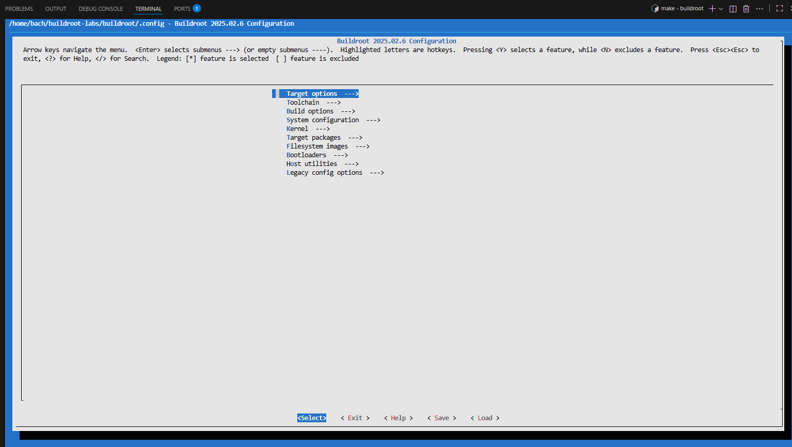

Đến đây ta sẽ đi cấu hình từng mục phù hợp với board BeaglbonBlack nhé!!!

 Thực hiện cấu hình từng bước:

### 1. Target Options:
- Chúng ta biết rằng BeagleBone Black Wireless là nền tảng ARM (little endian), vì vậy chọn:
```bash
Target Architecture → ARM (little endian)
```
- Theo trang chính thức https://beagleboard.org/BLACK
, thiết bị này dùng Texas Instruments AM335x, dựa trên ARM Cortex-A8.
```bash
Target Architecture Variant → cortex-A8
```
- Có hai giao diện nhị phân (ABI) cho ARM: EABI và EABIhf.
Nếu không cần tương thích ngược, hãy chọn EABIhf vì hiệu suất tốt hơn:
```bash
Target ABI → EABIhf
```
#### Các giá trị còn lại giữ mặc định:

- **ELF là định dạng nhị phân**

- **VFPv3-D16 cho đơn vị dấu chấm động (FPU)**

- **ARM instruction set cho bộ lệnh (thay vì Thumb-2)**
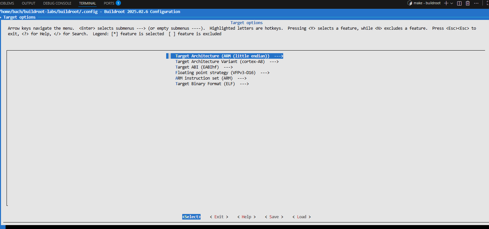

### 2. Build Options

- Không cần thay đổi gì, nhưng bạn có thể tham khảo và đọc phần mô tả (help) cho từng tùy chọn để hiểu rõ hơn.

### 3.Toolchain

- Theo mặc định, Buildroot sẽ tự xây dựng toolchain, nhưng việc này mất nhiều thời gian.
→ Chúng ta sẽ dùng external toolchain (có sẵn).
```bash
Toolchain type → External toolchain
```

Chọn:
```bash
Toolchain → Buidroot toolchains ( Buidroot sẽ giúp chúng ta tự động tạo ra một bộ toolchain( gcc, ldd, gdb) để sử dụng sau này
```

Hệ thống sẽ tự động chọn biến thể:
```bash
armv7-eabihf glibc bleeding-edge 2024.05-1
```
Các tùy chọn khác như C library , ... giữ nguyên.

Đây là lựa chọn phù hợp cho BeagleBone Black.

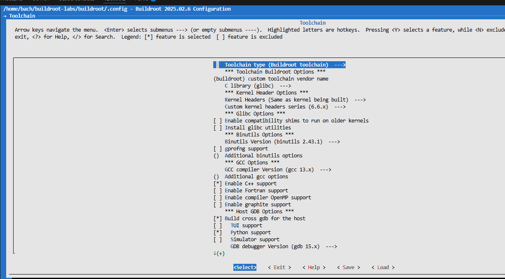

### 4. System Configuration

Trong hệ thống cơ bản này, chưa cần nhiều tùy chỉnh.
Bạn có thể đặt:

- System hostname (tên hệ thống)

- System banner (thông báo khi khởi động)

- Root password (mật khẩu root)

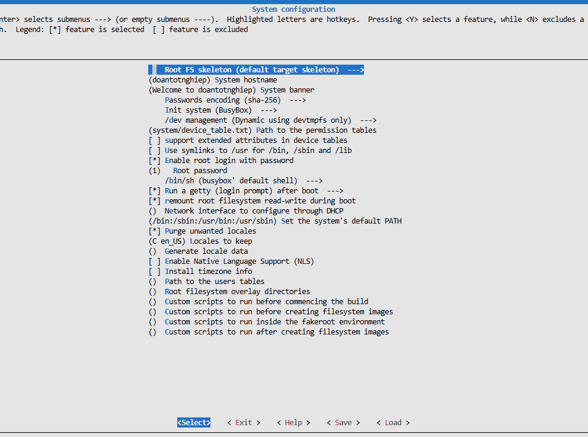

### 5.Kernel

Kích hoạt nhân Linux:
```bash
[*] Linux kernel
```


Sử dụng phiên bản cụ thể để đảm bảo tái lập build:
```bash
Kernel version → Custom version
Custom version → 6.12.47
```
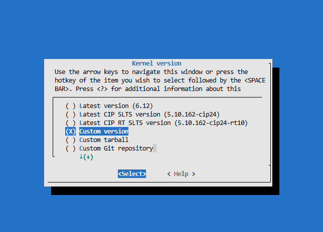

Chọn cấu hình sẵn (defconfig) trong mã nguồn kernel:
```bash
Defconfig name → omap2plus
```
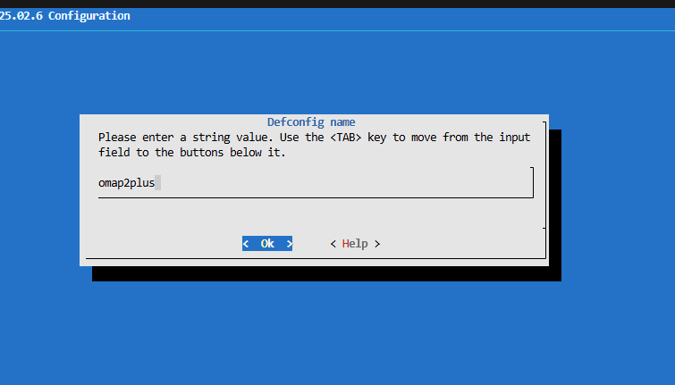

(Vì BeagleBone Black dựa trên dòng TI AM335x, được hỗ trợ trong OMAP2/3/4.)

Giữ định dạng nhị phân mặc định:
```bash
Kernel binary format → zImage
```
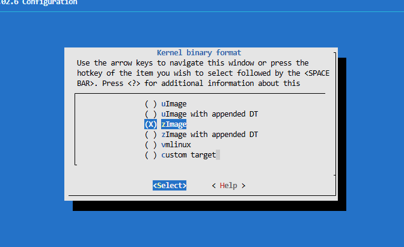

Bật Device Tree Blob (DTB):
```bash
[*] Build a Device Tree Blob (DTB)
In-tree Device Tree Source file names → ti/omap/am335x-boneblack
```
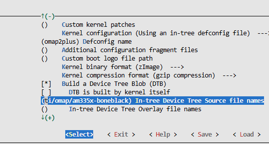

Kích hoạt OpenSSL cho host:
```bash
[*] Needs host OpenSSL
```

Hiển thị dấu * là đã bật nhé, nhấn dấu space để bật nhé.

### 6. Target Packages

- Menu này chứa hơn 3000+ gói Buildroot có thể chọn cài.

- Với hệ thống cơ bản, chỉ cần BusyBox (đã bật mặc định).

- Bạn có thể khám phá thêm các gói khác trong các bài lab sau.

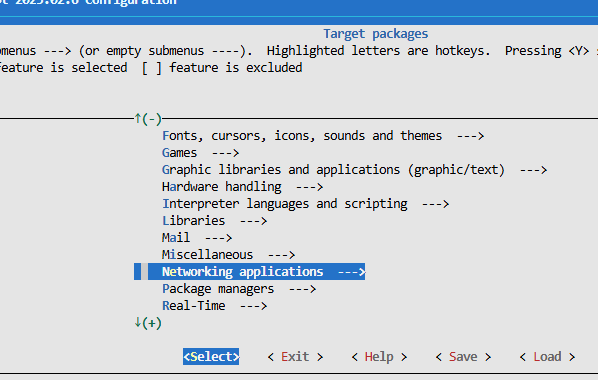

Ở đây bạn có thể bật các tool cần dùng cho kernel ví dụ như mosquitto (MQTT) hay là ssh ,.... chẳng hạn.

### 7 .Filesystem Images

Giữ tùy chọn mặc định:
```bash
[*] tar the root filesystem
```
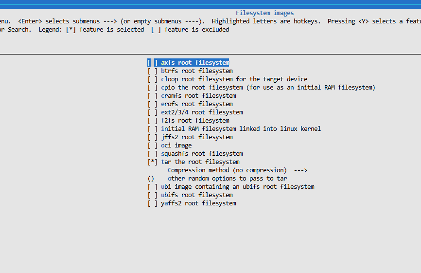

Việc flash root filesystem vào thẻ SD sẽ được thực hiện ở bước sau.

### 8. Bootloaders

Chọn U-Boot, bootloader phổ biến nhất cho ARM:
```bash
[*] U-Boot
```

Dùng hệ thống build kiểu Kconfig (phiên bản mới của U-Boot):
```bash
Build system → Kconfig
```

Phiên bản:
```bash
Custom version → 2024.04
```

Cấu hình board:
```bash
Board defconfig → am335x_evm
Custom make options → DEVICE_TREE=am335x-boneblack-wireless
```

U-Boot có 2 phần:
```bash
MLO: Bootloader giai đoạn đầu (SPL)

u-boot.img: Bootloader chính
```
Cấu hình tương ứng:
```bash
U-Boot binary format → u-boot.img
[*] Install U-Boot SPL binary image
U-Boot SPL binary image name → MLO
```

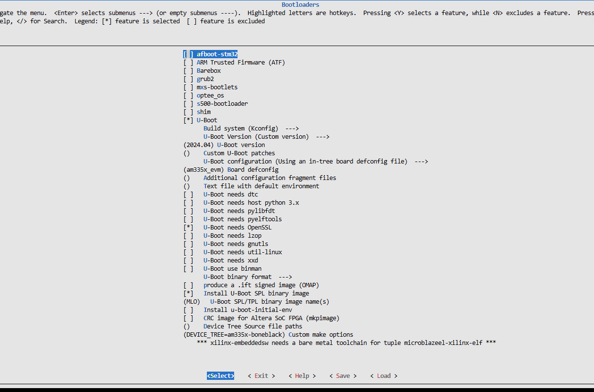

✅ Hoàn tất cấu hình!
Khi đã thiết lập xong, bạn có thể lưu cấu hình lại và thoát.

##  Biên dịch hệ thống (Building)

Bạn có thể đơn giản chạy lệnh:
```bash
make -j4 
```
4 ở đây là số luồng của máy ảo giúp ta build nhanh hơn đó.


Tuy nhiên, để lưu lại toàn bộ log quá trình build (bao gồm cả đầu ra chuẩn và lỗi) vào một tệp đồng thời vẫn hiển thị trên terminal, ta sẽ dùng lệnh:
```bash
make 2>&1 | tee build.log
```

Lệnh này sẽ:
```text
2>&1 gộp luồng lỗi (stderr) vào luồng chuẩn (stdout),

tee vừa ghi log vào tệp build.log, vừa in ra màn hình để bạn theo dõi tiến trình biên dịch.
```
💡 Mẹo: Tệp build.log rất hữu ích để kiểm tra khi build bị lỗi, bạn có thể tìm nhanh bằng grep hoặc mở bằng VSCode để xem chi tiết.

Trong khi quá trình biên dịch đang diễn ra (sẽ mất khá nhiều thời gian tùy vào cấu hình hệ thống và tốc độ mạng), bạn có thể chuẩn bị các bước tiếp theo để kiểm tra kết quả build trên thiết bị BeagleBone Black của mình.

### Quá trình build Buildroot sẽ tốn kha khá thời gian nên việc của chúng ta là chờ đợi , như máy mình là đợi tầm 45 phút là build xong.
 Sau khi build xong thì thứ ta quan tâm là distro các file cần thiết để boot lên Baeglebon, thường thì chúng sẽ nằm ở đây, các bạn gõ lệnh sau:
 ```bash
 ls -l output/images
 ```
 Các file bao gồm như sau:
 ```text
 buildroot/
├── output/
│   ├── build/               # Mã nguồn và file tạm của từng package (Linux kernel, BusyBox, U-Boot,…)
│   ├── host/                # Các công cụ Buildroot build để chạy trên máy host (toolchain, genimage,…)
│   ├── images/              # 🔥 Thư mục chứa toàn bộ file đầu ra cuối cùng
│   │   ├── rootfs.tar       # Root filesystem dạng tar (theo cấu hình bạn chọn)
│   │   ├── zImage           # Kernel image (nếu bạn bật build Linux kernel)
│   │   ├── am335x-boneblack-wireless.dtb  # Device Tree Blob
│   │   ├── MLO              # Bootloader SPL (giai đoạn 1)
│   │   └── u-boot.img       # Bootloader chính (giai đoạn 2)
│   ├── staging/             # Root filesystem tạm để cài đặt các package
│   └── target/              # Cây thư mục rootfs thật (chưa đóng gói, dạng copy ra SD nếu cần)
└── configs/
```
### 🔍 Giải thích chi tiết
| Thư mục           | Vai trò                                                                                   | Ghi chú                                        |
| ----------------- | ----------------------------------------------------------------------------------------- | ---------------------------------------------- |
| `output/build/`   | Mỗi package (kernel, uboot, busybox, openssl, …) sẽ được giải nén và build tại đây        | Có thể xem log build chi tiết của từng package |
| `output/host/`    | Chứa các công cụ build chạy trên máy host (ví dụ `host-gcc`, `mkimage`, `genext2fs`, …)   | Được Buildroot tự động quản lý                 |
| `output/images/`  | ✅ **Nơi chứa các file cuối cùng bạn sẽ flash lên thẻ SD hoặc dùng để khởi động thiết bị** | Đây là thư mục bạn quan tâm nhất               |
| `output/staging/` | Dạng rootfs trung gian — chưa dùng trực tiếp                                              | Buildroot dùng để copy vào `target/`           |
| `output/target/`  | Root filesystem đầy đủ của thiết bị (dạng thư mục)                                        | Có thể `chroot` hoặc tạo image từ đây          |

💡 Mẹo nhanh

Xem danh sách file đầu ra:
```bash
ls output/images/
```

Kiểm tra kích thước các thành phần:
```bash
du -h output/images/
```

Giải nén root filesystem để xem bên trong:
```bash
mkdir rootfs
sudo tar xf output/images/rootfs.tar -C rootfs/
ls rootfs/
```
Sau khi đã có đầy đủ các file rồi thì ta sẽ tiến hành copy vào thẻ nhớ sd card để boot lên board nhé, các bạn chuẩn bị một thẻ nhớ từ  8GB trở lên nhé.

## 💽 Chuẩn bị thẻ SD (Prepare the SD card)

Để hệ thống chạy được trên BeagleBone Black, chúng ta cần chuẩn bị thẻ SD với hai phân vùng riêng biệt:

** Cấu trúc phân vùng cần có**

- Phân vùng 1 – Bootloader (FAT32):

Dùng để chứa các tệp khởi động:
```bash
MLO (U-Boot SPL – bootloader giai đoạn 1)

u-boot.img (bootloader chính)

zImage (Linux kernel)

am335x-boneblack-wireless.dtb (Device Tree)
```
Phân vùng này phải tuân thủ quy định của SoC AM335x, nên định dạng là FAT32.

- Phân vùng 2 – Root filesystem (ext4):

    Dùng để chứa toàn bộ root filesystem của hệ thống Linux.

Sử dụng định dạng ext4.

###  Xác định thiết bị thẻ SD

Đầu tiên, hãy xác định tên thiết bị mà hệ thống gán cho thẻ SD của bạn bằng lệnh:
```bash
cat /proc/partitions
```

Nếu bạn dùng đầu đọc thẻ SD tích hợp trên laptop, thường sẽ thấy tên như:
```bash
/dev/mmcblk0
```

Nếu bạn dùng đầu đọc SD qua USB, nó sẽ hiển thị dạng:

/dev/sdX  (ví dụ: /dev/sdb, /dev/sdc, ...)


⚠️ Cẩn thận!
/dev/sda thường là ổ cứng của máy tính, không được nhầm lẫn khi format, vì sẽ mất toàn bộ dữ liệu hệ thống!

###  Quy ước tên phân vùng

Nếu thẻ SD của bạn là /dev/mmcblk0,
thì các phân vùng bên trong sẽ là:

- **/dev/mmcblk0p1   → phân vùng 1 (boot)**
- **/dev/mmcblk0p2   → phân vùng 2 (rootfs)**

###  Các bước format thẻ SD
1. Tháo (unmount) tất cả phân vùng của thẻ SD

Ubuntu thường tự động mount các phân vùng, bạn cần tháo chúng ra trước:
```bash
sudo umount /dev/mmcblk0p*
```
2. Xóa sạch phần đầu thẻ SD

Điều này đảm bảo các phân vùng cũ không còn được hệ thống nhận nhầm:
```bash
sudo dd if=/dev/zero of=/dev/mmcblk0 bs=1M count=16
```
3. Tạo hai phân vùng mới

Sử dụng công cụ cfdisk:
```bash
sudo cfdisk /dev/mmcblk0
```

Chọn dos làm kiểu bảng phân vùng (dos partition table)

Tạo phân vùng thứ nhất:
```bash
Dung lượng: 128 MB

Loại: Primary

Kiểu (Type): e (W95 FAT16)

Đánh dấu bootable
```
Tạo phân vùng thứ hai:
```bash
Dùng toàn bộ dung lượng còn lại

Loại: Primary

Kiểu (Type): 83 (Linux)

Thoát và lưu thay đổi trong cfdisk
```
4. Định dạng phân vùng boot (FAT32)
```bash
sudo mkfs.vfat -a -F 32 -n boot /dev/mmcblk0p1
```

Tham số:
```text
-a → kích hoạt auto-align

-F 32 → định dạng FAT32

-n boot → đặt nhãn (label) là boot
```

5. Định dạng phân vùng rootfs (ext4)
```bash
sudo mkfs.ext4 -L rootfs -E nodiscard /dev/mmcblk0p2
```

Giải thích:

-L rootfs: đặt tên volume là rootfs

-E nodiscard: tắt chế độ kiểm tra và loại bỏ block xấu, giúp tăng tốc format đáng kể (vì SD card thường không có bad block thật).

6. Kiểm tra kết quả

Sau khi hoàn tất, tháo thẻ SD ra và cắm lại — Ubuntu sẽ tự động mount hai phân vùng:
```bash
/media/$USER/boot
/media/$USER/rootfs
```

💡 Giờ đây, bạn đã có một thẻ SD được chia 2 phân vùng sẵn sàng để copy kernel, bootloader và root filesystem vào.

Kiểm tra lại phân vùng , gõ:
```bash
lsblk
```

đảm bảo phân vùng đã đầy đủ các file như sau:
| Phân vùng          | Kích thước   | Hệ thống tệp (Filesystem) | Nhãn (Label) | Nội dung lưu trữ                                                                       | Ghi chú                                        |
| ------------------ | ------------ | ------------------------- | ------------ | -------------------------------------------------------------------------------------- | ---------------------------------------------- |
| **/dev/mmcblk0p1** | ~128 MB      | **FAT32**                 | `boot`       | - `MLO` (U-Boot SPL) <br> - `u-boot.img` <br> - `zImage` <br> - `am335x-boneblack.dtb` | Phân vùng **boot**, phải FAT32 để SoC đọc được |
| **/dev/mmcblk0p2** | Phần còn lại | **ext4**                  | `rootfs`     | - Toàn bộ root filesystem của Linux                                                    | Phân vùng **root**, dùng cho hệ thống chính    |

Sau khi đầy đủ rồi, thì rút thẻ nhó ra cắm vào Beaglebon Black để boot nhé! Ta sẽ dùng nguồn 3V3 hoặc 5V để cấp nguồn, cách boot là giữ nút S2 ( nút boot từ thẻ nhớ, nếu không giữ thì mặc định BBB sẽ boot từ eMMC), giữ nút S2 rồi cắm nguồn, theo dõi log qua UART 

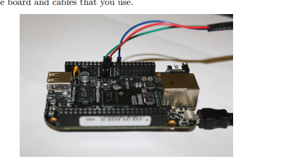

cắm dây UART như trong ảnh nhé. Sau khi boot thành công thì log sẽ hiện ra kiểu như sau, ví dụ:

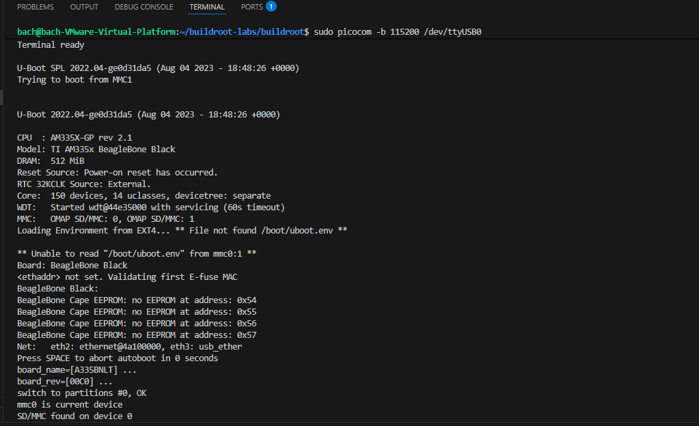
Như này là U-boot đã chạy rồi, khi boot vào được đến đây, mình ấn nút space để vào chế độ U-boot shell , ta sẽ tiếp tục cấu hình môi trường để BBB boot tự động cho những lần sau:
```bash
fatload mmc 0:1 0x82000000 zImage
fatload mmc 0:1 0x88000000 am335x-boneblack.dtb
setenv bootargs console=ttyO0,115200n8 root=/dev/mmcblk0p2 rw rootwait
setenv bootcmd 'fatload mmc 0:1 0x82000000 zImage; fatload mmc 0:1 0x88000000 am335x-boneblack.dtb; bootz 0x82000000 - 0x88000000'
saveenv
bootz 0x82000000 - 0x88000000
```
Tiếp đó, kernel sẽ chạy:


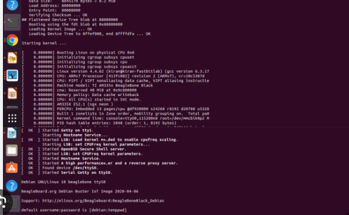

### Kernel chạy xong là đến phần đăng nhập, ở đây bạn nhập tên user và password đã cài đặt ở phần System Configuration để đăng nhập vào Buildroot là thành công rồi nhé. Như vậy là ta đã hoàn tất việc tạo một distro hoàn chỉnh từ Buildroot cho BBB rồi.
--- 
# Hướng dẫn thêm, sửa, xóa package trong Buildroot

Buildroot quản lý hơn 3000 package (phần mềm, driver, thư viện, ứng dụng...) thông qua cấu trúc cây thư mục, các file .mk và .Config.in.
Để tùy chỉnh, bạn có thể thêm, sửa, hoặc xóa package tùy nhu cầu hệ thống.

 1. Cấu trúc thư mục package trong Buildroot

Các package trong Buildroot nằm trong thư mục:
```text
package/
│
├── busybox/
│   ├── Config.in
│   ├── busybox.mk
│   └── ...
│
├── dropbear/
│   ├── Config.in
│   ├── dropbear.mk
│   └── ...
│
└── local/
    └── helloworld/
        ├── Config.in
        ├── helloworld.mk
        └── src/
```

 Giải thích:

- Config.in: Định nghĩa cấu hình để bật/tắt package trong menuconfig

- *.mk: Định nghĩa cách Buildroot build & cài package (giống Makefile)

- src/: Chứa mã nguồn (nếu là package nội bộ tự viết)

 2. Thêm package mới

-  Bước 1: Tạo thư mục cho package mới

Ví dụ, bạn muốn thêm ứng dụng "helloworld":
```bash
cd buildroot/package
mkdir helloworld
cd helloworld
```
 Bước 2: Tạo file Config.in
```bash
menuconfig "Hello World package"
config BR2_PACKAGE_HELLOWORLD
    bool "helloworld"
    help
      Ứng dụng ví dụ in ra dòng chữ Hello World.
```
 Bước 3: Tạo file helloworld.mk
```bash
################################################################################
#
# helloworld
#
################################################################################

HELLOWORLD_VERSION = 1.0
HELLOWORLD_SITE = $(TOPDIR)/package/helloworld/src
HELLOWORLD_SITE_METHOD = local

define HELLOWORLD_BUILD_CMDS
	$(MAKE) -C $(@D)
endef

define HELLOWORLD_INSTALL_TARGET_CMDS
	$(INSTALL) -D -m 0755 $(@D)/helloworld $(TARGET_DIR)/usr/bin/helloworld
endef

$(eval $(generic-package))
```
 Bước 4: Thêm mã nguồn

Tạo thư mục src/ và file helloworld.c:
```bash
#include <stdio.h>

int main(void) {
    printf("Hello, Buildroot world!\n");
    return 0;
}
```

Thêm Makefile trong src/:
```bash
nano Makefile
```
```bash
all:
	$(CC) helloworld.c -o helloworld
```
Bước 5: Kết nối vào hệ thống Buildroot

Mở file package/Config.in và thêm dòng sau ở cuối:
```bash
sudo nano Config.in
```
```bash
source "package/helloworld/Config.in"
```
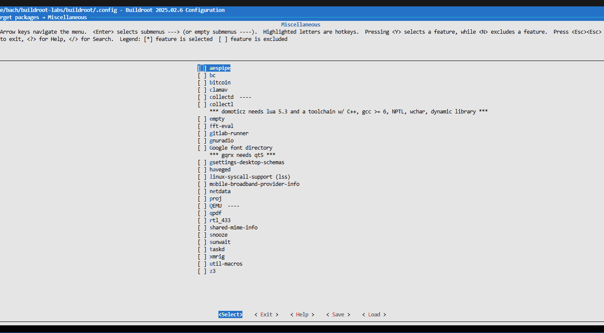

 Bước 6: Bật package trong menuconfig, 
 ```bash
make menuconfig
```

→ Vào Target packages → Miscellaneous ->tìm “helloworld” → chọn [ * ].

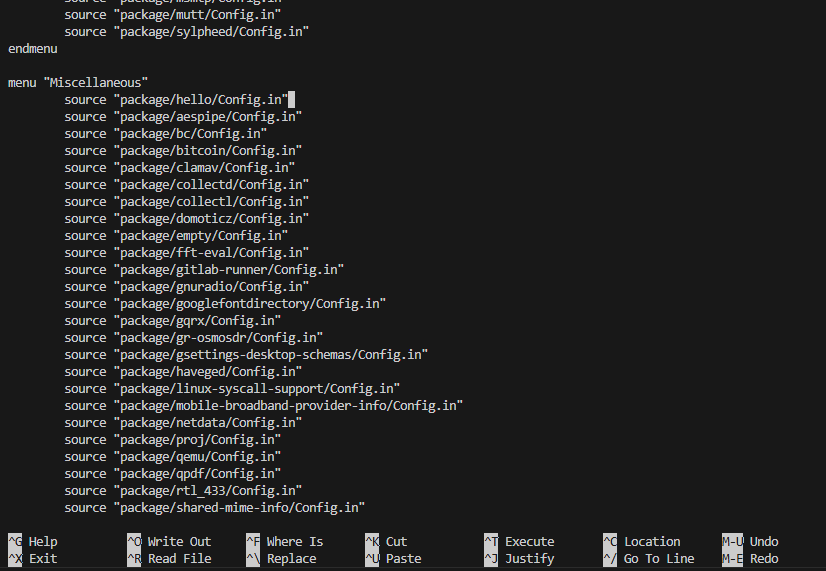

 Bước 7: Build lại hệ thống
 ```bash
make
```

Sau khi build xong, kiểm tra trong rootfs:
```bash
output/target/usr/bin/helloworld
```
 3. Sửa package có sẵn

Để sửa một package (ví dụ dropbear):

Mở package/dropbear/dropbear.mk để chỉnh sửa quy trình build/install.

Hoặc sửa package/dropbear/Config.in nếu muốn thêm tùy chọn mới trong menuconfig.

Sau khi sửa, rebuild lại package:
```bash
make dropbear-dirclean
make dropbear
```

 Mẹo:
make <package>-dirclean xóa thư mục build của package đó, ép build lại từ đầu.

4. Xóa package khỏi Buildroot

Để loại bỏ hoàn toàn một package:

Xóa thư mục package/<package_name>/

Mở file package/Config.in và xóa dòng:
```bash
source "package/<package_name>/Config.in"
```

Chạy lại menuconfig và rebuild:
```bash
make menuconfig
make clean
make
```
 5. Tóm tắt lệnh 

| Mục đích                      | Lệnh                                        |
| ----------------------------- | ------------------------------------------- |
| Chạy lại cấu hình             | `make menuconfig`                           |
| Xây dựng toàn bộ hệ thống     | `make`                                      |
| Build lại 1 package cụ thể    | `make <package>`                            |
| Xóa cache & rebuild 1 package | `make <package>-dirclean && make <package>` |
| Xóa toàn bộ output            | `make clean`                                |

 6. Kết quả

Sau khi thêm package thành công, file binary sẽ xuất hiện trong:
```bash
output/target/usr/bin/<package_name>
```

Khi boot lên board, bạn có thể chạy:
```bash
#helloworld
Hello, Buildroot world!
```
--- 

# Quy trình thêm một Package (Application hoặc Driver) vào Buildroot

Tương tự như ở trên,
việc thêm một package tùy chỉnh (ứng dụng, thư viện hoặc driver) vào Buildroot gồm 3 phần chính:

## 1. Cấu trúc thư mục package

Tất cả các package của Buildroot đều nằm trong thư mục:
```bash
buildroot/package/
```

Mỗi package có thư mục riêng.
Ví dụ, ta sẽ thêm package “hello” (ứng dụng đơn giản in ra “Hello Buildroot”).

Tạo thư mục:
```bash
cd buildroot/package
mkdir hello
cd hello
```
## 2. Tạo các file mô tả package

Mỗi package cần ít nhất 2 file:

### 2.1. Config.in

Khai báo package trong menu cấu hình (make menuconfig):
```bash
config BR2_PACKAGE_HELLO
    bool "hello"
    help
      Simple Hello World application for Buildroot demo.
```
### 2.2. hello.mk

Định nghĩa cách Buildroot tải, build và cài đặt package:
```bash
################################################################################
#
# hello
#
################################################################################

HELLO_VERSION = 1.0
HELLO_SITE = $(TOPDIR)/../board/local/hello
HELLO_SITE_METHOD = local

define HELLO_BUILD_CMDS
	$(MAKE) CC="$(TARGET_CC)" -C $(@D)
endef

define HELLO_INSTALL_TARGET_CMDS
	$(INSTALL) -D -m 0755 $(@D)/hello $(TARGET_DIR)/usr/bin/hello
endef

$(eval $(generic-package))
```
## 3. Thêm vào menu chính của Buildroot

Mở file:
```bash
buildroot/package/Config.in


Thêm dòng sau vào cuối:

source "package/hello/Config.in"


Giờ package “hello” sẽ xuất hiện trong menu:

Target packages  --->
    Miscellaneous  --->
        [*] hello
```
## 4. Tạo mã nguồn ứng dụng hoặc driver
### Ứng dụng (Application)

Tạo thư mục chứa mã nguồn:
```bash
mkdir -p board/local/hello
cd board/local/hello
```

Tạo file main.c:
```bash
#include <stdio.h>

int main(void) {
    printf("Hello Buildroot World!\n");
    return 0;
}
```

Tạo Makefile:
```bash
all:
	$(CC) main.c -o hello

clean:
	rm -f hello
```
### Driver (Kernel Module)

Tạo thư mục chứa mã nguồn:
```bash
mkdir -p board/local/led_driver
cd board/local/led_driver
```

Tạo led_driver.c:
```bash
#include <linux/module.h>
#include <linux/kernel.h>

static int __init led_init(void)
{
    pr_info("LED driver initialized\n");
    return 0;
}

static void __exit led_exit(void)
{
    pr_info("LED driver exited\n");
}

module_init(led_init);
module_exit(led_exit);
MODULE_LICENSE("GPL");
```

Tạo Makefile:
```bash
obj-m := led_driver.o
```
### 5. Tạo file .mk cho driver

Ví dụ: package/led_driver/led_driver.mk
```bash
################################################################################
#
# led_driver
#
################################################################################

LED_DRIVER_VERSION = 1.0
LED_DRIVER_SITE = $(TOPDIR)/../board/local/led_driver
LED_DRIVER_SITE_METHOD = local
LED_DRIVER_MODULE_SUBDIRS = .

$(eval $(kernel-module))
$(eval $(generic-package))

```
Và Config.in tương ứng:
```bash
config BR2_PACKAGE_LED_DRIVER
    bool "led_driver"
    depends on BR2_LINUX_KERNEL
    help
      Simple example LED kernel driver.
```

Cuối cùng, thêm vào package/Config.in:
```bash
source "package/led_driver/Config.in"
```
### 6. Cấu hình và build

Chạy lệnh:
```bash
make menuconfig
```

Bật package mới:
```bash
Target packages  --->
    Miscellaneous  --->
        [*] hello
Kernel modules  --->
        [*] led_driver

```
Build hệ thống:
```bash
make
```
###  7. Kiểm tra kết quả

Sau khi build xong, kiểm tra trong thư mục:

Ứng dụng:
```bash
output/target/usr/bin/hello
```

Driver:
```bash
output/target/lib/modules/<kernel-version>/extra/led_driver.ko
```
### 8. Kiểm tra trên board thật
Chạy ứng dụng:
```bash
# hello
Hello Buildroot World!
```
Nạp driver:
```bash
# insmod led_driver.ko
# dmesg | tail
[   12.345] LED driver initialized
```
### Ghi chú thêm

Đặt các package tự viết trong package/local_apps giúp quản lý gọn gàng hơn.

Khi update source, có thể rebuild nhanh package bằng:
```bash
make hello-dirclean
make hello
```

Buildroot tự động xử lý phụ thuộc (dependency) giữa các package thông qua phần select và depends on trong Config.in.