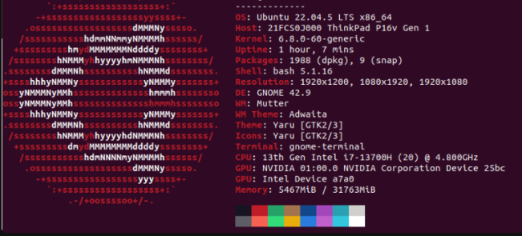
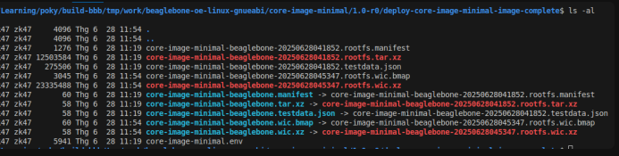
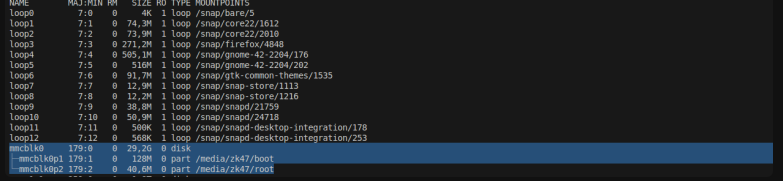
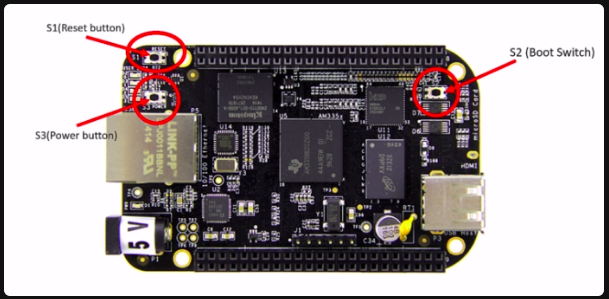
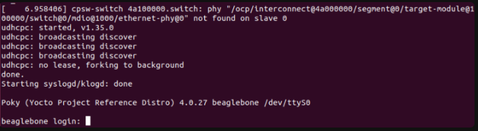

# Cấu hình và build sản phẩm bằng Yocto
## [Yocto-BBB]  Lý thuyết, Tài liệu, và câu lệnh thường dùng trong Series Yocto
Khi thực hành theo các bài trong series, có những câu lệnh mình thường dùng, có 1 số lý thuyết có thể dễ quên, và 1 số tài liệu phụ. Ở bài này mình sẽ tổng hợp lại để cho các bạn dễ theo dõi, làm theo hơn .

### 1. Lý thuyết
```text
Yocto Project là gì ?
Poky là gì ?
Open Embedded là gì ?
Bitbake là gì ?
Recipes là gì ?
Layer là gì ?
File .bb, .bbappend, .bbclass 
```
### 2. Tài liệu

Reference Manual Beaglebone Black : https://www.ti.com/lit/ug/spruh73q/spruh73q.pdf?ts=1757666524292&ref_url=https%253A%252F%252Fwww.google.com%252F

Yocto Project Reference Manual: https://docs.yoctoproject.org/ref-manual/index.html

### 3. Câu lệnh thường dùng
3.1 Yocto command
```bash
source poky/oe-init-build-end <build-dir>
#Khởi tạo môi trường build, add bitbake vào PATH  
```
```bash
bitbake <recipes>
# build <recipes>
```
```bash
bitbake -c <task> <recipes>
# build <recipes> từ đầu cho đến hết <task>
```
```bash
bitbake -e <recipes> | grep ^<Variable>
# lấy được các biến môi trường (env) của recipes
# grep dòng bắt đầu bởi <Variable>
```
```bash
bitbake-layers show-recipes
# Hiển thị địa chỉ toàn bộ recipes (file .bb) đang để tại meta-layer nào 
# Nếu chỉ đích danh <recipes> thì chỉ hiện meta-layer chứa nó
bitbake-layers show-recipes <recipes>
```
```bash
bitbake-layers show-appends <recipes>
# Tương tự với câu lệnh trên nhưng sẽ hiển thị địa chỉ file append (bbapend)
```
```bash
bitbake-layers show-layers 
# Hiển thị toàn bộ layers trong <build-dir>/conf/bbalyers.conf với Priority
```
```bash
bitbake-layers create-layer
# Tạo layer mới
```bash
```bash
bitbake-layers add-layer
# add layer tới bblayers.conf
```
```bash
oe-pkgdata-util lookup-recipe kernel
# Tim recipes kernel để các bạn có thể tạo file append
```
```bash
bitbake -c menuconfig virtual/kernel
# Bật menuconfig sửa kernel build config
```
### 3.2 Linux command
```bash
lsblk
# list block, dùng để check địa chỉ thẻ nhớ 
# ví dụ như /dev/sda, /dev/sdb, /dev/mmcblk0
```
```bash
bmaptool copy <yocto-build-image>.wic.xz <uSD disk>
# Flash thẻ nhớ với image, ví dụ như 
bmaptool copy core-image-minimal-beaglebone.wic.xz /dev/mmcblk0
```
```bash
find . -name <file-name>
# dùng để tìm kiếm đệ quy bắt đầu từ folder hiện tại tìm file-name
```
```bash
df -h 
# disk filesystem
# -h : Human readable, đổi sang hệ Gb, Mb, Kb cho ngừời dễ đọc 
```
```bash
free -h
# check dung lượng memory (RAM) 
```

---
---
## [Yocto-BBB] . Build Beaglebone Black Image Bằng Yocto Project
### Bắt đầu series về build bủng bằng Yocto thôi, bài đầu sẽ về build cho Beaglebone Black


1. Chuẩn bị bên máy host (Máy để build)
2. Clone source code
3. Setup và build
   - 3.1. Tạo môi trường build
    - 3.2 Thay đổi conf file
    -  3.3 Build thôi
4. Flash image SD card
     - 4.1 Check image
     -  4.2 Copy image sang sd card
### 1. Chuẩn bị bên máy host (Máy để build)
Ở đây máy mình cài Ubuntu 22.04.5 LTS (Jammy Jellyfish). Mình cài dual boot với windows để tối ưu core.

Dựa theo hướng dẫn bên Yocto Project Reference Manual , mục 1.3.2.1. Ta cài các package sau
```bash
sudo apt-get install gawk wget git-core diffstat unzip texinfo gcc-multilib \
     build-essential chrpath socat cpio python3 python3-pip python3-pexpect \
     libsdl1.2-dev xterm make xsltproc docbook-utils fop dblatex xmlto
```
### 2. Clone source code
Chúng ta dùng bản poky là 1 repo mẫu từ bên Yocto Project (reference repo) với phiên bản Kirkstone 4.0 (Mình tính cài nhiều board với cùng folder Poky này nên cài bản này cho có tính tương thích cao hơn Scarthgap 5.0 mới ra)
```bash

git clone -b kirkstone git://git.yoctoproject.org/poky/
```
```bash
cd poky
 ```
 ```bash
git clone -b kirkstone git://git.openembedded.org/meta-openembedded
 ```
 ```bash
git clone -b kirkstone git://git.yoctoproject.org/meta-ti
 ```
 ```bash
git clone -b kirkstone https://git.yoctoproject.org/meta-arm
```
### 3. Setup và build
- 3.1. Tạo môi trường build
```bash
source oe-init-build-env build-bbb
```
Câu lệnh này sẽ
```text
Set $OEROOT : Xác định thư mục gốc của yocto
Set $PATH : Thêm bitbake vào path của session terminal, giống kiểu thêm vào biến môi trường ở Windows
Set $BUILDDIR : Chọn thư mục output ./build-bbb (default sẽ là build, nhưng nếu chạy cho nhiều board thì nên chia riêng)
Set $BBPATH : Để bitbake tìm thấy các layer
Tạo cấu trúc thư mục $BUILDDIR
```


- 3.2 Thay đổi conf file

   Thông thường ta sẽ thay đổi config file của môi trường build, bằng các layer, tuy nhiên ở đây để đơn giản mình sẽ thay đổi trong local.conf
```bash
nano ./build-bbb/conf/local.conf
```
Ta thay đổi MACHINE ?= “beaglebone”
```bash
nano ./build-bbb/conf/bblayers.conf
```
Ta add thêm các meta-openembedded, meta-arm, meta-ti, để có thêm các tính năng sẽ dùng sau
```bash
POKY_BBLAYERS_CONF_VERSION = "2"
 
BBPATH = "${TOPDIR}"
BBFILES ?= ""
 
BBLAYERS ?= " \
/home/zk47/Learning/poky/meta \
/home/zk47/Learning/poky/meta-poky \
/home/zk47/Learning/poky/meta-yocto-bsp \
/home/zk47/Learning/poky/meta-openembedded/meta-oe \
/home/zk47/Learning/poky/meta-arm/meta-arm-toolchain \
/home/zk47/Learning/poky/meta-arm/meta-arm \
/home/zk47/Learning/poky/meta-ti/meta-ti-bsp \
/home/zk47/Learning/poky/meta-ti/meta-ti-extras \
 
"
```
Lưu ý đường dẫn trong BBLAYERS là đường dẫn tuyệt đối tới các meta-layers, do đó sẽ tùy theo máy.

### 3.3 Build thôi
```bash
bitbake core-image-minimal
```
Ở đây mình chọn image này vì đúng như tên gọi, nó là cái tinh giản nhất, đúng chỉ là lên được OS, số lượng package rất it, nên build nhanh.

Tùy vào máy của các bạn, như máy mình build thời gian build rơi vào tầm hơn 1 tiếng.



### 4. Flash image SD card
- 4.1 Check image

Sau khi build xong nếu các bạn không biết output ở đâu có thể check bằng câu lệnh
```bash
bitbake -e core-image-minimal | grep ^WORKDIR=
```

- bitbake -e <recipe> : Liệt kê environment hay các biến được set trong 1 recipe
- grep ^WORKDIR= : tìm các dòng bắt đầu bằng “WORKDIR=” 

Output của câu lệnh sẽ dạng
```bash
bach@bach-VMware-Virtual-Platform:~/Learning/poky/build-bbb$ bitbake -e core-image-minimal | grep ^WORKDIR=
WORKDIR="/home/zk47/Learning/poky/build-bbb/tmp/work/beaglebone-oe-linux-gnueabi/core-image-minimal/1.0-r0"
```
Các bạn vào được thư mục đó rồi mở tiếp folder deploy image sau cùng
```bash
cd /home/zk47/Learning/poky/build-bbb/tmp/work/beaglebone-oe-linux-gnueabi/core-image-minimal/1.0-r0
cd deploy-core-image-minimal-image-complete
```
4.2 Copy image sang sd card

Trong thư mục này sẽ có rất nhiều image



Nhưng để cho nhanh mình sẽ dùng image .wic.xz (tối ưu việc copy hơn do có bmap)

Các bạn cắm sd card vào, nếu đã có phân vùng được mount thì nhớ unmount trước, check bằng câu lệnh lsblk



Như ở đây thẻ nhớ mình đang nhận ở /dev/mmcblk0 và có 2 phân vùng đã được mount do đó ta cần umount nó trước
```bash
sudo umount /media/zk47/boot /media/bach/root
```
Sau đó ta copy sử dụng bmaptool
```bash
sudo bmaptool copy core-image-minimal-beaglebone.wic.xz /dev/mmcblk0
```
Và thế là xong, ta đã build thành công và flash vào thẻ nhớ. Giờ ta cắm thẻ nhớ vào BBB và test thôi.

Lưu ý giữ button S2 (boot button) để BBB nhận boot từ MMC1 là thẻ nhớ, nếu không giữ button S2 BBB sẽ boot từ MMC2 là eMMC.




–> Chúng ta sẽ đăng nhập bằng user root, không có mật khẩu




