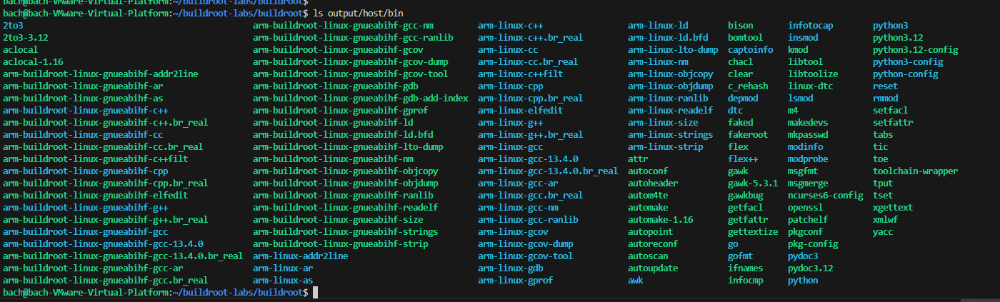
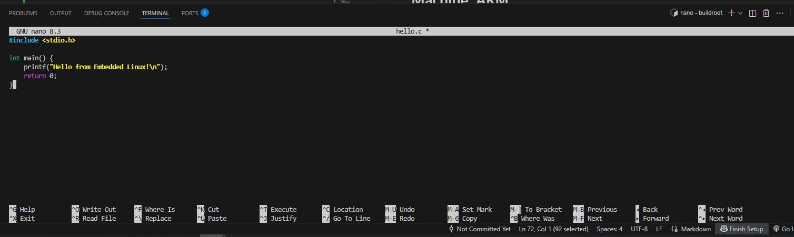
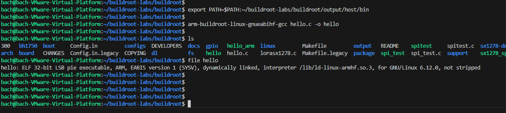
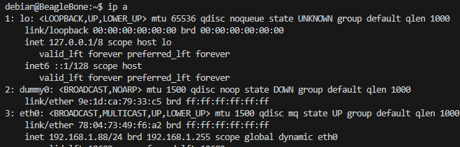

# Phát triển và tích hợp Application

### 4.1. Chuẩn bị Cross-Toolchain từ Buildroot
#### 4.1.1. Cross-Toolchain là gì?
> Cross-toolchain là bộ công cụ biên dịch chạy trên máy host (thường là x86_64) nhưng tạo ra code thực thi cho kiến trúc đích khác (ARM, MIPS, v.v.). Điều này cần thiết vì:

> Thiết bị nhúng thường có tài nguyên hạn chế, không đủ để biên dịch
> Tốc độ biên dịch trên máy host nhanh hơn nhiều
> Dễ dàng debug và quản lý

#### 4.1.2. Buildroot tạo Cross-Toolchain
Ở phần 2 mình cũng đã hướng dẫn các bạn về việc chúng ta sẽ sử dụng Buildroot để tạo ra một bộ toolchain để ta có thể biên dịch trên các ứng dụng trên máy host (Ubuntu) chẳng hạn.

Khi build Buildroot, một cross-toolchain được tự động tạo tại:
```bash
output/host/bin/
```
Ví dụ với ARM:
```bash
arm-buildroot-linux-gnueabihf-gcc
arm-buildroot-linux-gnueabihf-g++
arm-buildroot-linux-gnueabihf-ld
arm-buildroot-linux-gnueabihf-objdump
```
Như của mình thì là như này:




#### 4.1.3. Sử dụng Cross-Toolchain
Cách 1: Thêm vào PATH
```bash
export PATH=$PATH:/path/to/buildroot/output/host/bin
```
Cách 2: Sử dụng SDK độc lập
```bash
Trong menuconfig Buildroot
Build options --->
    [*] Build SDK for external use

# Sau khi build xong
make sdk
SDK sẽ được tạo tại: output/images/arm-buildroot-linux-gnueabihf_sdk-buildroot.tar.gz
```
Cách 3: Sử dụng wrapper script
File: environment-setup
```bash
#!/bin/bash
export CROSS_COMPILE=arm-buildroot-linux-gnueabihf-
export CC=${CROSS_COMPILE}gcc
export CXX=${CROSS_COMPILE}g++
export AR=${CROSS_COMPILE}ar
export AS=${CROSS_COMPILE}as
export LD=${CROSS_COMPILE}ld
export PATH=/path/to/buildroot/output/host/bin:$PATH
export SYSROOT=/path/to/buildroot/output/host/arm-buildroot-linux-gnueabihf/sysroot
```
Sử dụng:
```bash
source environment-setup
```
**Note: ở đây mình khuyến nghị mọi người dùng luôn cách 1, dùng toolchain của Buidlroot luôn vì khá là đầy đủ.**

### 4.2. Biên dịch và Cài đặt Application
#### 4.2.1. Biên dịch Application đơn giản
Ví dụ 1: Hello World
File hello.c:
```bash
nano hello.c
```
```bash
#include <stdio.h>

int main() {
    printf("Hello from Embedded Linux!\n");
    return 0;
}
```


Biên dịch:
```bash
arm-buildroot-linux-gnueabihf-gcc hello.c -o hello
```
Kiểm tra:
bashfile hello
# Output: hello: ELF 32-bit LSB executable, ARM, version 1 (SYSV)...



File hello màu xanh là là file binary sau khi được biên dịch và có định dạng 32 bit ELF là chuẩn để khi ta đưa sang BBB thì nó có thể chạy được, còn nếu như mà định dạng là 64 ELF thì BBB sẽ không thể thực thi được. Vậy nên khi build xong mọi người nhớ kiểm tra nhé, vd với file hello:
```
file hello
```
or
```bash
arm-buildroot-linux-gnueabihf-readelf -h hello | grep Machine
```
# Machine: ARM
Ví dụ 2: Application với thư viện
File json_example.c:
```bash
#include <stdio.h>
#include <json-c/json.h>

int main() {
    struct json_object *obj = json_object_new_object();
    json_object_object_add(obj, "name", json_object_new_string("Device"));
    json_object_object_add(obj, "value", json_object_new_int(42));
    
    printf("%s\n", json_object_to_json_string(obj));
    json_object_put(obj);
    return 0;
}
```
Biên dịch với sysroot:
```bash
arm-buildroot-linux-gnueabihf-gcc \
    --sysroot=/path/to/buildroot/output/host/arm-buildroot-linux-gnueabihf/sysroot \
    -ljson-c json_example.c -o json_example
```
- Với cách này thì ta sẽ chỉ đích trực tiếp sysroot( bao gồm các gcc, ldd, ) để biên dịch file.

#### 4.2.2. Cài đặt lên Target ( target ở đây là BBB)

Đầu tiên, trên BBB ta check ip của nó bằng cách:
```bash
ip a
```
Ip của BBB sẽ hiện ra và đây là địa chỉ mà ta sẽ scp file từ máy host sang


Phương pháp 1: Copy qua NFS/SSH
```bash
scp hello root@192.168.1.100:/usr/bin/
```
Phương pháp 2: Thêm vào rootfs overlay

Tạo cấu trúc thư mục
```bash
mkdir -p buildroot/board/myboard/rootfs-overlay/usr/bin
cp hello buildroot/board/myboard/rootfs-overlay/usr/bin/
```
# Trong menuconfig
```text
System configuration --->
    (board/myboard/rootfs-overlay) Root filesystem overlay directories
```
Phương pháp 3: Tạo package Buildroot
Cấu trúc
```text
package/hello/
├── hello.mk
└── Config.in
```
### 4.3. Quản lý Phụ thuộc
#### 4.3.1. Kiểm tra Phụ thuộc
Sử dụng ldd

Trên host (không hoạt động cho cross-compiled binary)
Phải dùng cross-ldd hoặc copy vào target

Trên target
```bash
ldd /usr/bin/json_example
```
-  Output:
```bash
# libjson-c.so.5 => /usr/lib/libjson-c.so.5
# libc.so.6 => /lib/libc.so.6
```
Sử dụng readelf
```bash
arm-buildroot-linux-gnueabihf-readelf -d json_example | grep NEEDED
```bash
Output:
```bash
# 0x00000001 (NEEDED)  Shared library: [libjson-c.so.5]
# 0x00000001 (NEEDED)  Shared library: [libc.so.6]
```
#### 4.3.2. Đảm bảo Thư viện có trong Rootfs
Trong Buildroot menuconfig:
```bash
Target packages --->
    Libraries --->
        JSON/XML --->
            [*] json-c
```
#### 4.3.3. Static vs Dynamic Linking
Dynamic linking (mặc định):
```bash
arm-buildroot-linux-gnueabihf-gcc hello.c -o hello
```
```bash
ls -lh hello  # ~10KB
```
Static linking:
```bash
arm-buildroot-linux-gnueabihf-gcc -static hello.c -o hello_static
```
```bash
ls -lh hello_static  # ~700KB
```


### 4.4. Hướng dẫn cơ bản về Makefile

**Vai trò của Makefile**

Makefile định nghĩa cách biên dịch, liên kết và tạo file thực thi cho ứng dụng.
Trong môi trường Buildroot, nó được sử dụng để:

- Tự động hóa quá trình build.

- Đảm bảo sử dụng đúng toolchain.

- Giúp Buildroot tích hợp ứng dụng dễ dàng.

#### Ví dụ Makefile đơn giản

File Makefile cho ứng dụng hello:
```bash
# Tên chương trình
TARGET = hello

# Trình biên dịch (được Buildroot gán giá trị tương ứng)
CC = $(TARGET_CC)

# Cờ biên dịch
CFLAGS = -Wall

# File mã nguồn
SRC = hello.c

# Quy tắc build
all:
	$(CC) $(CFLAGS) -o $(TARGET) $(SRC)

# Quy tắc dọn dẹp
clean:
	rm -f $(TARGET)

```
**Giải thích:**

> $(TARGET_CC) là biến môi trường Buildroot, ví dụ: arm-buildroot-linux-gnueabihf-gcc.

> -Wall: bật các cảnh báo khi biên dịch.

> clean: dùng để xóa file cũ, giúp build sạch sẽ.

###  Biên dịch cho host (development)
```
make
```
**Hiểu đơn giản thì Makefile như một file bao gồm tất cả các lệnh liên quan đến việc biên dịch, thao tác , quản lí trong một project , giúp ta tùy chỉnh với nhiều project lớn mà có nhiều file chẳng hạn.**

### 4.5. Tích hợp ứng dụng  vào Buildroot

### Bước 1: Tạo thư mục package mới

Cấu trúc thư mục:
```bash
buildroot/
└── package/
    └── hello/
        ├── Config.in
        ├── hello.mk
        └── src/
            └── hello.c
```

###  Bước 2: Viết file Config.in

File này giúp hiển thị ứng dụng trong menu Buildroot (make menuconfig).
```bash
config BR2_PACKAGE_HELLO
    bool "hello"
    help
      Một chương trình Hello World đơn giản, dùng để kiểm thử môi trường Buildroot.
```
### Bước 3: Viết file hello.mk (Makefile)
```bash
################################################################################
#
# hello
#
################################################################################

HELLO_VERSION = 1.0
HELLO_SITE = $(TOPDIR)/package/hello/src
HELLO_SITE_METHOD = local

HELLO_LICENSE = GPL-2.0+
HELLO_DEPENDENCIES =

define HELLO_BUILD_CMDS
	$(TARGET_CC) $(TARGET_CFLAGS) -o $(@D)/hello $(HELLO_SITE)/hello.c
endef

define HELLO_INSTALL_TARGET_CMDS
	$(INSTALL) -D -m 0755 $(@D)/hello $(TARGET_DIR)/usr/bin/hello
endef

$(eval $(generic-package))

```
Giải thích:
| Dòng                         | Ý nghĩa                                           |
| ---------------------------- | ------------------------------------------------- |
| `HELLO_VERSION`              | Phiên bản ứng dụng                                |
| `HELLO_SITE`                 | Đường dẫn chứa mã nguồn                           |
| `HELLO_SITE_METHOD`          | `local` nghĩa là mã nguồn nằm trong cây Buildroot |
| `HELLO_BUILD_CMDS`           | Lệnh build ứng dụng                               |
| `HELLO_INSTALL_TARGET_CMDS`  | Cách cài đặt vào filesystem của target            |
| `$(eval $(generic-package))` | Macro Buildroot dùng để đăng ký package           |

###  Bước 4: Thêm vào menu Buildroot

Mở file:
```bash
package/Config.in
```

Thêm dòng sau vào cuối:
```bash
source "package/hello/Config.in"
```
### Bước 5: Kích hoạt và Build

Chạy lệnh:
```bash
make menuconfig
```
Đi đến:
```text
Target packages  --->
    [*] hello
```

Sau đó build lại toàn bộ:
```bash
make
``` 
 ### Bước 6: Kiểm tra kết quả

Sau khi boot thiết bị target (hoặc chạy QEMU):
```bash
# hello
Hello Buildroot!
```

Nếu hiển thị dòng trên, ứng dụng đã được tích hợp thành công!!!

Nhiều bạn  sẽ có thắc mắc tại sao ta không làm thủ công build app mà lại tích hợp vào Buildroot để build, thì sau đây là một số lợi ích của việc dùng Buildroot nhé:
### Tác dụng của việc tích hợp Application vào Buildroot

Khi ta “tích hợp” (integration) một ứng dụng vào hệ thống Buildroot, tức là ta đưa ứng dụng đó trở thành một phần của quy trình build tự động của Buildroot.
Việc này mang lại nhiều lợi ích quan trọng trong phát triển hệ thống nhúng:

#### 1. Tự động hóa quá trình build

Khi tích hợp vào Buildroot, ứng dụng của bạn sẽ được build cùng lúc với toàn hệ thống (kernel, rootfs, thư viện, toolchain, ...).

Bạn không cần biên dịch thủ công từng lần — Buildroot sẽ tự động:

Biên dịch ứng dụng.

Cài đặt vào đúng vị trí trong filesystem (/usr/bin, /etc, ...).

Bao gồm trong file image cuối cùng (ví dụ: .img, .iso, .tar).

**Lợi ích: Tiết kiệm thời gian, loại bỏ lỗi do thao tác thủ công, dễ tái tạo build.**

#### 2. Quản lý phụ thuộc (Dependencies) hiệu quả

Buildroot biết rõ ứng dụng cần thư viện nào (libpng, openssl, zlib, ...).

Hệ thống sẽ tự động tải, biên dịch và cài đặt các thư viện cần thiết trước khi build ứng dụng.

 **Lợi ích: Đảm bảo môi trường build chính xác, tránh lỗi “thiếu thư viện” hoặc “sai version”.**

#### 3. Dễ dàng tùy chỉnh và mở rộng

Mỗi ứng dụng là một “package” độc lập trong Buildroot.

Có thể dễ dàng bật/tắt ứng dụng trong menu cấu hình (make menuconfig).

Có thể thêm tuỳ chọn build (debug, optimize, custom flags) thông qua Makefile.

**Lợi ích: Dễ thử nghiệm, tái cấu hình, và kiểm soát chính xác nội dung trong hệ thống.**

#### 4. Tích hợp vào hệ thống file và image

Khi tích hợp thành công, ứng dụng sẽ được đưa vào hệ thống file (rootfs).

Khi Buildroot tạo image (như .img hoặc .iso), ứng dụng sẽ có sẵn trên thiết bị khi khởi động.

**Lợi ích: Ứng dụng luôn được cài đặt sẵn, không cần cài thủ công sau khi flash.**

####  5. Dễ bảo trì và cập nhật

Khi có thay đổi trong mã nguồn, chỉ cần chạy lại make, Buildroot sẽ tự động rebuild phần bị thay đổi.

Dễ dàng kiểm soát phiên bản thông qua HELLO_VERSION hoặc git tag.

**Lợi ích: Dễ quản lý phiên bản, cập nhật ứng dụng trong hệ thống nhúng.**

####  6. Tái sử dụng trong nhiều dự án

Khi ứng dụng được đóng gói chuẩn Buildroot (có Config.in và .mk), ta có thể sử dụng lại trong các dự án khác chỉ bằng cách copy thư mục package/appname.

**Lợi ích: Tạo được kho package nội bộ dùng chung cho nhiều hệ thống.**

#### 7. Đồng bộ môi trường phát triển và triển khai

Buildroot đảm bảo rằng ứng dụng được build với cùng toolchain, cùng thư viện, cùng môi trường với hệ thống thật.

Tránh lỗi kiểu “chạy được trên máy tính nhưng không chạy được trên thiết bị”.

**Lợi ích: Ổn định, đáng tin cậy, tránh sai khác môi trường.**

| Mức độ                | Không tích hợp                                  | Khi tích hợp vào Buildroot       |
| --------------------- | ----------------------------------------------- | -------------------------------- |
| **Build app**         | Thủ công, phải set PATH, cross-compile bằng tay | Tự động khi chạy `make`          |
| **Cài đặt**           | Copy tay vào target                             | Tự động cài đúng vị trí          |
| **Phụ thuộc**         | Phải tự cài library                             | Buildroot tự quản lý             |
| **Tái build**         | Dễ lỗi, mất thời gian                           | Nhanh, chỉ rebuild phần thay đổi |
| **Quản lý phiên bản** | Khó kiểm soát                                   | Tập trung trong `.mk`            |
| **Tái sử dụng**       | Phải làm lại                                    | Dễ mang sang dự án khác          |
| **Ổn định hệ thống**  | Dễ sai môi trường                               | Hoàn toàn đồng bộ                |


 
