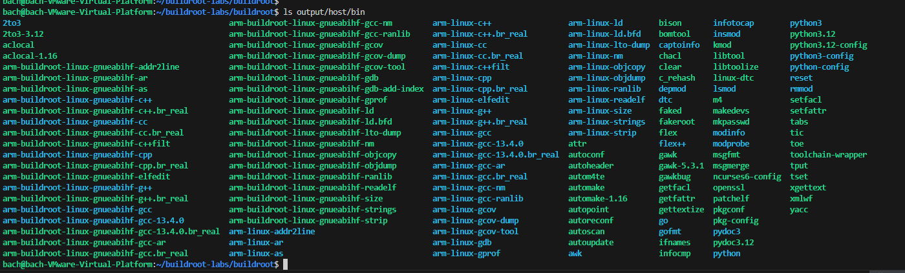
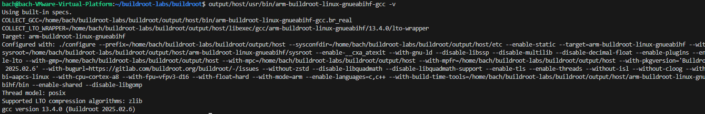
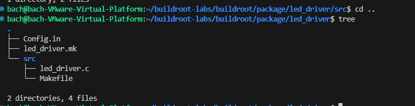

# Phát triển và tích hợp Device Driver
Tương tự như phát triển và tích hợp Application thì đối với Deivce Driver cũng gần tương tự như vậy. Bao gồm các việc sau:
### 5.1. Chuẩn bị Cross-Toolchain từ Buildroot
### Khái niệm

Cross-toolchain là bộ công cụ cho phép biên dịch mã nguồn kernel hoặc driver trên máy phát triển (host) để chạy trên thiết bị nhúng (target).
Buildroot có thể tự động sinh ra toolchain phù hợp với kiến trúc của hệ thống nhúng.

### Các bước chuẩn bị

#### Bước 1: Cấu hình toolchain trong Buildroot

Mở cấu hình:
```bash
make menuconfig
```
Chọn:
```bash
Toolchain  --->


Cấu hình:

Toolchain type: Buildroot toolchain

Target Architecture: Chọn đúng kiến trúc của thiết bị (VD: ARM, RISC-V, x86)

C library: glibc, musl, hoặc uClibc

Kernel headers: Phải phù hợp với version kernel đang dùng (ví dụ: 5.10.x)
```
###  Bước 2: Build toolchain
```bash
make toolchain
```

Sau khi hoàn tất, toolchain sẽ nằm tại:
```bash
output/host/usr/bin/
```


Ví dụ:
```text
arm-buildroot-linux-gnueabihf-gcc
```
###  Bước 3: Kiểm tra toolchain
```bash
output/host/usr/bin/arm-buildroot-linux-gnueabihf-gcc -v
```

**Khi hiển thị thông tin GCC là toolchain đã sẵn sàng để biên dịch kernel module hoặc driver.**



 ### 5.2. Biên dịch và Cài đặt Device Driver

Giả sử ta có driver mẫu tên là led_driver.c để điều khiển LED thông qua GPIO.

#### Mã nguồn mẫu (led_driver.c)
```bash
#include <linux/module.h>
#include <linux/kernel.h>
#include <linux/gpio.h>
#include <linux/init.h>

#define LED_PIN 21

static int __init led_init(void) {
    gpio_request(LED_PIN, "LED");
    gpio_direction_output(LED_PIN, 0);
    printk(KERN_INFO "LED driver loaded\n");
    return 0;
}

static void __exit led_exit(void) {
    gpio_set_value(LED_PIN, 0);
    gpio_free(LED_PIN);
    printk(KERN_INFO "LED driver unloaded\n");
}

module_init(led_init);
module_exit(led_exit);

MODULE_LICENSE("GPL");
MODULE_AUTHOR("Sinh viên");
MODULE_DESCRIPTION("Simple LED GPIO driver");
```
#### Biên dịch thủ công bằng cross-toolchain

Tạo file Makefile cho driver:
```bash
obj-m += led_driver.o

all:
	make ARCH=arm CROSS_COMPILE=arm-buildroot-linux-gnueabihf- -C /path/to/linux M=$(PWD) modules

clean:
	make -C /path/to/linux M=$(PWD) clean

```
Biên dịch:
```bash
make
```

Sau khi build xong, bạn sẽ có file:
```bash
led_driver.ko
```
####  Cài đặt vào hệ thống target

Copy driver vào thiết bị:
```bash
cp led_driver.ko output/target/lib/modules/
```

Sau khi flash image sang thiết bị, nạp driver:
```bash
insmod /lib/modules/led_driver.ko
```

Kiểm tra:
```bash
lsmod
dmesg | tail
```
###  5.3. Quản lý Phụ thuộc (Dependencies)

Một driver có thể cần phụ thuộc vào:

- Kernel headers (bắt buộc)

- Các module hoặc thư viện kernel khác (GPIO, I2C, SPI, USB, v.v.)

- Firmware hoặc thiết bị phần cứng cụ thể

- Trong Buildroot, khai báo phụ thuộc trong file .mk:
```bash
LED_DRIVER_DEPENDENCIES = linux
```

Khi đó Buildroot sẽ:

Tự động build kernel trước.

Sau đó biên dịch module driver.

**Lợi ích: Đảm bảo driver luôn được build trên đúng phiên bản kernel.**

###  5.4. Makefile của Driver

Một Makefile chuẩn cho kernel module trong Buildroot:
```bash
################################################################################
#
# led_driver
#
################################################################################

LED_DRIVER_VERSION = 1.0
LED_DRIVER_SITE = $(TOPDIR)/package/led_driver/src
LED_DRIVER_SITE_METHOD = local

LED_DRIVER_LICENSE = GPL-2.0+
LED_DRIVER_DEPENDENCIES = linux

define LED_DRIVER_BUILD_CMDS
	$(MAKE) ARCH=$(KERNEL_ARCH) CROSS_COMPILE=$(TARGET_CROSS) \
		-C $(LINUX_DIR) M=$(@D)/src modules
endef

define LED_DRIVER_INSTALL_TARGET_CMDS
	$(INSTALL) -D -m 644 $(@D)/src/led_driver.ko \
		$(TARGET_DIR)/lib/modules/$(LINUX_VERSION_PROBED)/led_driver.ko
endef

$(eval $(generic-package))
```

Giải thích:

| Dòng                              | Ý nghĩa                                           |
| --------------------------------- | ------------------------------------------------- |
| `LED_DRIVER_DEPENDENCIES = linux` | Đảm bảo kernel được build trước                   |
| `ARCH` / `CROSS_COMPILE`          | Dùng toolchain tương ứng của target               |
| `$(LINUX_DIR)`                    | Thư mục chứa mã nguồn kernel                      |
| `modules`                         | Chỉ build phần module, không build toàn bộ kernel |
| `INSTALL_TARGET_CMDS`             | Copy module vào thư mục `/lib/modules/`           |

###  5.5. Tích hợp Driver vào Buildroot
### Bước 1: Tạo thư mục package
```text
package/
└── led_driver/
    ├── Config.in
    ├── led_driver.mk
    └── src/
        ├── led_driver.c
        └── Makefile
```

### Bước 2: Viết file Config.in
```bash
config BR2_PACKAGE_LED_DRIVER
    bool "LED GPIO driver"
    depends on BR2_LINUX_KERNEL
    help
      Driver điều khiển LED thông qua GPIO.
```
###  Bước 3: Viết file led_driver.mk
```bash
include $(sort $(wildcard package/led_driver/*.mk))
Nội dung chi tiết đã trình bày ở phần 5.4 Makefile ở trên.
```



####  Bước 4: Thêm vào menu Buildroot

Mở file:
```bash
package/Config.in
```

Thêm dòng:
```bash
source "package/led_driver/Config.in"
```

#### Bước 5: Kích hoạt và build
```bash
make menuconfig
```

Vào:
```bash
Target packages  --->
    [*] LED GPIO driver

```
Sau đó, thoát ra ngoài và build thôi:
```bash
make
```

Sau khi build xong, driver .ko sẽ có sẵn trong image và có thể nạp trực tiếp trên BeagleBon rồi:, các bạn scp file build được qua Ip của BBB nhé.

bạn có thể tìm file bằng lệnh:
```bash
find output/ -name led_driver.ko
```

Kết quả thường là:
```bash
output/target/lib/modules/<kernel-version>/led_driver.ko

```
Ví dụ:
```bash
output/target/lib/modules/6.1.0/led_driver.ko
```

Sau khi copy file từ máy host sang BBB rồi thì nạp driver chạy thử:
```bash
insmod /lib/modules/led_driver.ko
```

